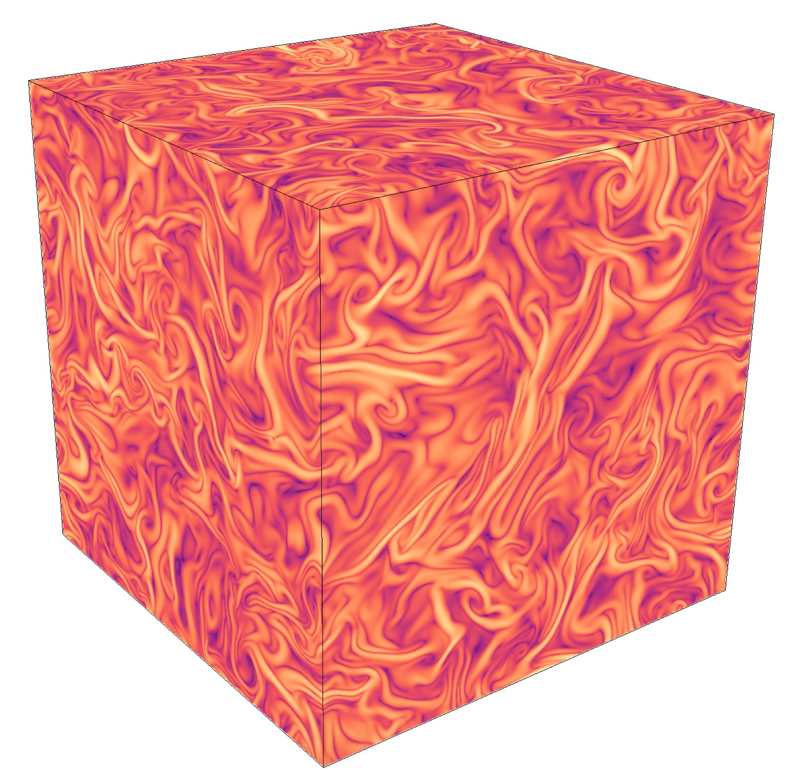

==========================
Eulerian-Lagrangian fluid dynamics platform based on the Lattice-Boltzmann method
==========================

Introduction
============

A general purpose *Lattice-Boltzmann* code for fluid-dynamics simulations. It includes :

- **fluid dynamics**  (with several volume forcing terms for Channel flow, Homogeneous Isotropic Turbulence, buoyancy)
- **temperature dynamics** (advection, diffusion , sink/source or reaction terms)
- **phase change** (enthalpy formulation for solid/liquid systems)
- **scalar transport** (same functionalities as temperature)
- **lagrangian dynamics** (tracers, heavy/light & active  point-like particles; non-shperical Jeffery rotation, gyrotaxis)
- **large eddy simulation** (Smagorinsky, Shear Improved Samgorinsky with Kalman Filter)

Requirements:

- MPI
- HDF5
- CMake (optional)

History
=======

This project is a continuation and extension https://github.com/ecalzavarini/ice-project

Contact
=======
This project is based at Unite de Mecanique de Lille (UML EA 7512, http://uml.univ-lille.fr ) France.

For more information please contact:

Enrico Calzavarini <enrico.calzavarini@polytech-lille.fr> , www.ecalzavarini.info

*Contributors*: Kalyan Shrestha, Babak Rabbanipour Esfahani (Lille University, FR), Vojtech Patocka (Charles University, Prague CZ), Linfeng Jiang, Ziqi Wang (Tsinghua University, Beijing CHINA)

How to:
======
See wiki pages https://github.com/ecalzavarini/ch4-project/wiki (very incomplete)

Aknowledgments:
======
This project received support from the INNOCOLD consortium (innocold.fr) and by the French National Agency for Research (ANR) by the grant (SEAS: ANR-13-JS09-0010).

Bibliography:
======
This code can be cited as:

0) *Eulerian-Lagrangian fluid dynamics platform: The ch4-project* Enrico Calzavarini, Software Impacts **1**, 100002 (2019).
   https://doi.org/10.1016/j.simpa.2019.100002

This code has been employed in the following published studies:

1) *Finite volume versus streaming-based lattice Boltzmann algorithm for fluid-dynamics simulations: A one-to-one accuracy and performance study*, Kalyan Shrestha, Gilmar Mompean and Enrico Calzavarini, Phys. Rev. E **93**, 023306 (2016).
   https://link.aps.org/pdf/10.1103/PhysRevE.93.023306

2) *Micro-bubbles and micro-particles are not faithful tracers of turbulent acceleration*, Varghese Mathai, Enrico Calzavarini,  Jon Brons, Chao Sun and Detlef Lohse, Phys. Rev. Lett. **117**, 024501 (2016).
   https://link.aps.org/doi/10.1103/PhysRevLett.117.024501

3) *Propelled microprobes in turbulence*, Enrico Calzavarini, Yongxiang X. Huang, Francois G. Schmitt and Lipo Wang, Phys. Rev. Fluids **3**, 054604 (2018).
   https://link.aps.org/doi/10.1103/PhysRevFluids.3.054604

4) *Basal melting driven by turbulent thermal convection*, Babak Rabbanipour Esfahani, Silvia C. Hirata, Stefano Berti and Enrico Calzavarini, Phys. Rev. Fluids **3**, 053501 (2018).
   https://link.aps.org/doi/10.1103/PhysRevFluids.3.053501

5) *Robustness of heat-transfer in confined inclined convection at high-Prandtl number*, Linfeng Jiang, Chao Sun and Enrico Calzavarini, Phys. Rev. E **99**, 013108 (2019).
   https://link.aps.org/doi/10.1103/PhysRevE.99.013108

6) *Anisotropic particles in two-dimensional convective turbulence*, Enrico Calzavarini, Linfeng Jiang and Chao Sun, Phys. Fluids **32**, 023305 (2020).
   https://doi.org/10.1063/1.5141798

7) *Rotation of anisotropic particles in Rayleigh-Benard turbulence*,  Linfeng Jiang, Enrico Calzavarini and Chao Sun, J. Fluid Mech. **901**, A8 (2020).
   http://dx.doi.org/10.1017/jfm.2020.539

8) *Settling of inertial particles in turbulent Rayleigh-Benard convection*, Vojtech Patocka, Enrico Calzavarini, Nicola Tosi, Phys. Rev. Fluids **5**, 114304 (2020).
   https://doi.org/10.1103/PhysRevFluids.5.114304

9) *Rotational dynamics of bottom-heavy rods in turbulence from experiments and numerical simulations*, Linfeng Jiang, Cheng Wang, Shuang Liu, Chao Sun, Enrico Calzavarini, Theo. App. Mechanics Lett., *100227* (2021).
   https://doi.org/10.1016/j.taml.2021.100227

10) *Ice front shaping by upward convective current*, Ziqi Wang, Linfeng Jiang, Yihong Du, Chao Sun, Enrico Calzavarini, Phys. Rev. Fluids **6**, L091501 (2021). https://doi.org/10.1103/PhysRevFluids.6.L091501

11) *Equilibrium states of the ice-water front in a differentially heated rectangular cell*, Ziqi Wang, Enrico Calzavarini, Chao Sun, Europhys. Lett. (EPL), 135 (2021) 54001. https://doi.org/10.1209/0295-5075/ac30e7
